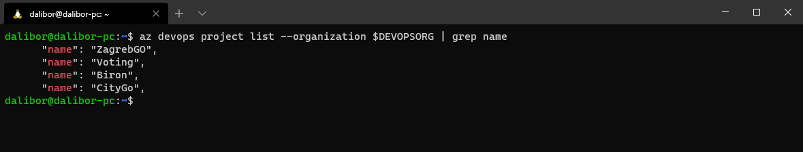
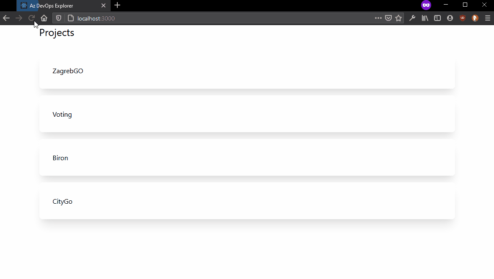

# Az DevOps Explorer

This is an application built to try out the following tech stack :

* [Azure CLI](https://docs.microsoft.com/en-us/cli/azure/install-azure-cli)
* [Azure DevOps CLI](https://docs.microsoft.com/en-us/azure/devops/cli/?view=azure-devops)
* [F#](https://fsharp.org/) / [Argu](http://fsprojects.github.io/Argu/) / [Suave](https://suave.io/)
* [Create react app](https://create-react-app.dev/)
* [Tailwind CSS](https://tailwindcss.com/)

Some code and structure inspired by https://github.com/ActiveSolution/ActiveGameNight

The idea is to explore an application model in which I can build web apis and web uis on top of CLI apps.

## Prerequisites

To be albe to run this application you will need to :

* Install and log in to Azure CLI
* Install Azure CLI DevOps extension
* Have some projects and releases in Azure DevOps

## Running locally

From the root directory :

```
cd server-app/
dotnet run --organization "https://dev.azure.com/my-organization"
```

```
cd client-app/
npm run start
```

## Screenshots



